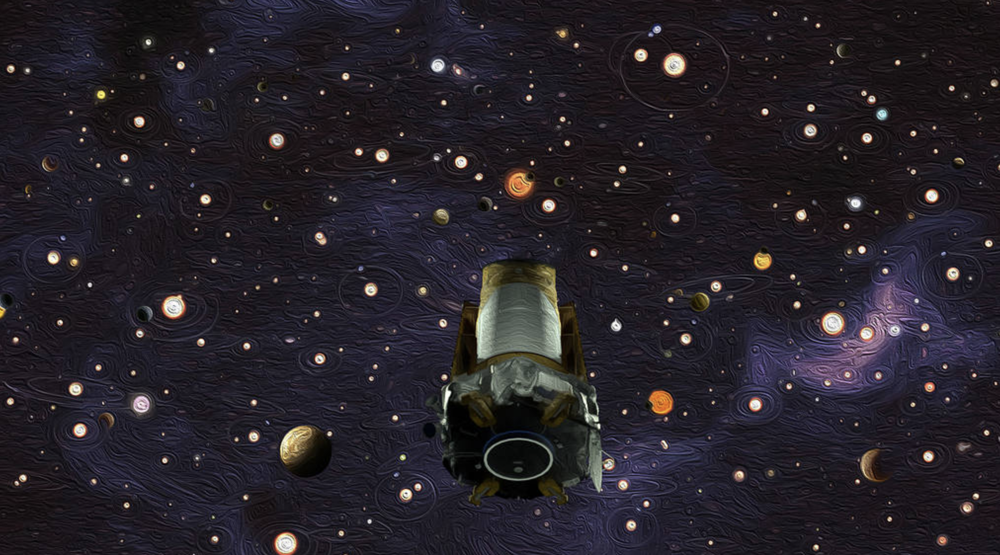
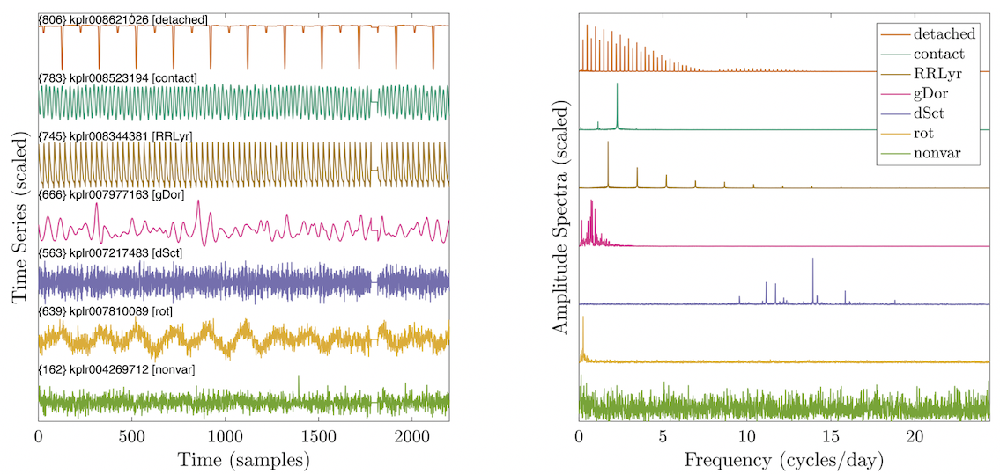
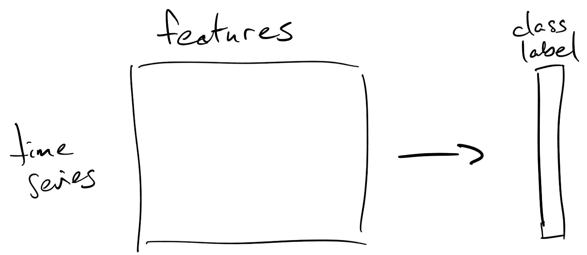

# PHYS3888 Computer Lab: Classifying Kepler Light Curves

_Acknowledgement_: This tutorial is based on a [recent research paper](https://doi.org/10.1093/mnras/stac1515) from researchers in the School of Physics (including our [Asteroseismology group](https://sifa.sydney.edu.au/asteroseismology/)).

In this tutorial, we will learn how to analyze a dataset of light curves measured from [NASA's _Kepler_ mission](https://www.nasa.gov/mission_pages/kepler/overview/index.html).
You can learn more about the _Kepler_ mission in [this YouTube video](https://www.youtube.com/watch?v=3yij1rJOefM).



Gone are the days of manually observing and storing a handful of stars; modern astronomy is characterized by datasets of unprecedented size and complexity :milky_way:.
Because it is unfeasible for human researchers to manually sift through datasets of this magnitude, research methods have adapted: modern astronomers use statistical learning methods to find and quantify patterns in big astrophysical datasets.

In this tutorial, you will work through the techniques and concepts introduced in the lecture to analyze data from the _Kepler_ mission.
By the end of the tutorial, you will have developed a simple algorithm to automatically distinguish different types of stars from patterns in how their brightness varies over time.
This repeated measurement of brightness over time is called a [_light curve_](https://imagine.gsfc.nasa.gov/science/toolbox/timing1.html).

The amazing _Kepler_ light curve time series that we will be analyzing today __takes a brightness measurement every 29.45 minutes__.

## Background

Today we'll tackle the problem of predicting the type of star from the properties of its light curve.

:question::question::question: __Q1:__

What type of problem is this:

- Is it a supervised or unsupervised problem?
- Is it a classification or regression problem?

There are seven different classes of stars that we're interested in detecting (class labels are annotated in parentheses):

1. Detached binary (`'detached'`)
2. Contact binary (`'contact'`)
3. RR Lyrae variable (`'RRLyr'`)
4. Gamma Doradus variable (`'gDor'`)
5. Delta Scuti variable (`'dSct'`)
6. Rotating variable (`'rot'`)
7. Non-variable (`'nonvar'`)

Take a moment to inspect a representative example of each class in the time-domain and frequency-domain plots shown below.
How do periodic structures in the time domain manifest in the frequency domain?
Just looking at the data, what types of properties do you think are going to be useful in distinguishing these seven types of stars?



### Exploring the dataset

First we need to understand how our data is structured.
A good place to start is our time-series data, stored in a _table_, `TimeSeries`, in the Matlab file `Kepler_TimeSeries.mat`.
Load the `TimeSeries` table into your Matlab workspace, and take a look at the first ten:

```matlab
load('Kepler_TimeSeries.mat','TimeSeries')
TimeSeries(1:10,:)
```

Each row of the `TimeSeries` table corresponds to a star observed by the Kepler telescope.
Light-curve data is contained in the `Data` column, while the other columns give additional information about each star, including its identity (`Name`) and assigned class (`Keywords`).

#### Working with tables

Verify that there are 1341 time series in total using `height(TimeSeries)`.
If you are not familiar with table objects in Matlab, note that you can pick out the time-series data for object `i` as `TimeSeries.Data{i}`, its ID as `TimeSeries.Name{i}`, and its class label as `TimeSeries.Keywords{i}`.
All metadata for object `i` is in the row `i`: `TimeSeries(i,:)`.

Input some of these types of commands to verify that you understand how to work with Matlab tables.

### Sampling frequency

:question::question::question: __Q2:__
What is the sampling rate, `fs` (Hz)?
Give your answer in scientific notation to four significant figures.

Implement your result into the `KeplerSamplingRate` function, which will allow all of the functions used in this tutorial to be properly calibrated to the Kepler light-curve data.

#### Plot a light curve

We will use `PlotTimeSeries`, to plot the light curve (brightness over time) of a selected star.
As you'll see in the template provided, the function takes three inputs:

1. The `TimeSeries` table,
2. An index of a time series to plot, and
3. A maximum number of samples to plot, `maxL`.

For the `PlotTimeSeries` function to work, you'll need to have set `fs` correctly in the `KeplerSamplingRate` function (above), and you'll also need to fill in the missing line of code in `PlotTimeSeries` to convert the time axis from seconds, `tSec`, to days, `tDay`.

Once you're ready, pick some indices for stars to plot, and in each case verify that you get a good visualization by running `PlotTimeSeries` appropriately.
If you need to, zoom in to see whether you can discern any interesting structure in the dynamics.

_Note:_ Don't worry if you spot some flat lines: these are artifactual periods (or missing data), that have been set to the signal's mean value.

### _Context_: Feature extraction

Recall from lectures that supervised learning problems can be represented in the form of:

1. An observation x feature data matrix (`X`), and
2. A target output vector (`y`).

In this tutorial we are going to represent time series by their different properties in the matrix `X`, and label each by one of seven categories of stars in `y`.



### Two-Class Classification

Seven classes is a bit daunting! :sweat_smile:
Let's first build some confidence by starting with a simpler two-class problem.

#### Filtering to a subset

Start by filtering down to a just two classes: `contact` and `nonvar`.

[:fire:___Optional___:fire:: If you are feeling adventurous, instead of `contact` and `nonvar`, you may select any pair of classes you're interested in, e.g., `gDor` and `dSct` (:fire:).
But note that the instructions below (and the lab solutions) will work through the example of picking `contact` and `nonvar`, so you'll need to modify the below to match the two classes you've selected].

You can achieve this by the following steps (fill in the blank `...`):

```matlab
% 1. Define the classes to keep:
classesToKeep = {'contact','nonvar'};

% 2. Find matches by applying the ismember function to the Keywords column of the Timeseries table:
isMatch = ismember(TimeSeries.Keywords,classesToKeep);

% 3. Apply the logical filter, isMatch, to rows of the original TimeSeries table
% to generate a new table, TimeSeriesTwoClass:
TimeSeriesTwoClass = ...;
```

Verify that you get 385 matches by counting the rows of the new table that contains just `'contact'` and `'nonvar'` stars:

```matlab
height(TimeSeriesTwoClass)
```

#### Plotting in the time and frequency domains

Periodicities are ubiquitous in nature, and a physicist's first instinct when working with a time series is to transform it to the frequency domain.
Being almost completely Sydney Uni-trained physicists, you should all be familiar with estimating the Fourier transform of a time series.
A simple implementation of this transform is in the `ToFrequency` function.
In producing a valid time axis, the function uses your `KeplerSamplingRate` function to set the sampling frequency.

Let's plot five examples of contact binary stars in the time domain (`PlotTimeSeries`) and the frequency domain `ToFrequency`.
First we'll need indices of all contact binaries (which have the label `contact`) in the `TimeSeriesTwoClass` table, which we can get using the `strcmp` function to find matches to the label `'contact'`:

```matlab
contactIndicies = find(strcmp(TimeSeriesTwoClass.Keywords,'contact'));
```

Then you can run the following code to plot the first five of them:

```matlab
PlotTimeFrequency(TimeSeriesTwoClass,contactIndicies,5)
```

From the titles, verify that all of the plotted examples are of the right class (`'contact'`), then repeat for the non-variable (`'nonvar'`) stars.

From inspecting just five examples of each type, do you think there are structures in the frequency domain that might distinguish these two classes of stars?
What types of properties of the Fourier power spectrum do you think will help you classify these two types of stars?

### Choose your own features :smile:

So now we have now wet our toes, we can get to the meat of our task.

Remember what our goal is?
It's to compute two numbers ('features') that can capture useful differences between `'contact'` and `'nonvar'` stars.

You will need to complete the function, `f = MyTwoFeatures(x);` that takes in a time-series, `x`, and outputs two features (real numbers stored in the two-element vector, `f`), that represent two different properties of the power spectrum.
A template has been worked up for you, including a _z_-score pre-processing step (which ensures that all light curves are placed on an equivalent scale, regardless of their absolute brightness).

You just need to implement the calculation of two features, as described below.

#### _Feature 1_: Peak in the power spectrum

Perhaps you noticed that the contact binaries have characteristic oscillations.
Let's first measure how 'peaky' the power spectrum is.
The simplest metric for quantifying this is to simply take the `max` of the power spectral density.

:fire::fire: _(Optional)_ :fire::fire:
Feel free to instead implement an alternative feature, like the `skewness`, or an explicit peak-finding functions like `findpeaks`---anything that implements this idea of generating a _single real number_ that captures the peakiness of the power spectrum.

#### _Feature 2_: Power in a frequency band

Oscillatory structure may also be concentrated in a particular frequency range.
Looking again at the frequency spectra you plotted above, pick a frequency range that you think is going to be informative of the differences between contact binaries and non-variable stars.
Implement this as your second feature in `MyTwoFeatures`.

_Note_: You should use the `bandpower` function, but ensure that your frequency range is measured in Hz.

#### Feature space

Now loop over all time series in `TimeSeriesTwoClass`, computing your two features for each.
Store the result as the 385 x 2 (time series x feature) matrix, `dataMatrixTwoClass`.

Here's some template code (fill in `...`):

```matlab
numTimeSeries = height(TimeSeriesTwoClass);
dataMatrixTwoClass = zeros(numTimeSeries,2);
for i = 1:numTimeSeries
    dataMatrixTwoClass(i,:) = ...;
end
```

:milky_way::stars::satisfied::star2::bowtie::star2::smile::star2::laughing::stars::milky_way:

Have a brief celebration!
You have just develeoped the main algorithmic machinery to convert light curves into an interpretable two-dimensional feature space that will enable the automatic classification of Kepler stars!

#### Plotting

Did you notice?: We now have the two ingredients we need for statistical learning:

1. An observation x feature data matrix (`dataMatrixTwoClass`)
2. Ground-truth labels for each item (`TimeSeriesTwoClass.Keywords`).

We should first denote these labels as a `categorical` data type (a set of discrete categories) instead of storing them as lots of pieces of text:

```matlab
classLabelsTwoClass = categorical(TimeSeriesTwoClass.Keywords);
```

Let's first see how our two features are doing at separating the two classes.
We can use the `gscatter` function to label our observations by their class:

```matlab
figure('color','w')
gscatter(dataMatrixTwoClass(:,1),dataMatrixTwoClass(:,2),classLabelsTwoClass)
xlabel('My Peakiness Feature')
ylabel('My Band Power Feature')
```

Depending on the choices you made for each feature, give each axis an appropriately descriptive label.

How well do your two features separate the two classes?

Given your understanding of what your features are measuring, can you interpret why the two classes are where they are in the feature space?

Are there any outliers?

### Training a classifier

So now we want to learn a rule to separate these two classes.
We're going to focus on a support vector machine (SVM) classifier, which can in simple terms be thought of as a souped-up variant of the single-neuron classifier we studied earlier.

Let's first __train SVM models__ to distinguish contact binaries from non-variable stars in our two-dimensional feature space.
We will use the `trainModels` function which takes in our observations (`dataMatrixTwoClass`) and the labels we want to the model to predict (`classLabelsTwoClass`):

```matlab
[Mdl_SVMlinear,Mdl_SVMnonlinear] = trainModels(dataMatrixTwoClass,classLabelsTwoClass)
```

You just did 'machine learning'.
Easy, huh?! :sweat_smile:

We can now use the trained linear model, stored in the variable `Mdl_SVMlinear`, to get the predicted labels for any new star.
For example, we can evaluate the predictions on the data we fed in by running:

```matlab
predictedLabelsTwoClass = predict(Mdl_SVMlinear,dataMatrixTwoClass);
```

To see how well we did, we can construct a confusion matrix as:

```matlab
[confMat,order] = confusionmat(classLabelsTwoClass,predictedLabelsTwoClass)
```

Does this simple linear SVM classifier accurately distinguish these two types of stars in your two-dimensional feature space?

Now let's step back a bit to investigate how these models are behaving in our feature space.
The `gridPredictions` function evaluates a given model across a grid of the feature space to visualize which parts of the feature space are predicted to be what class of star.

```matlab
doPosterior = false;
gridPredictions(Mdl_SVMlinear,dataMatrixTwoClass,classLabelsTwoClass,doPosterior);
```

Try both:

1. Setting `doPosterior = false` plots the predicted class at each point in feature space.
2. Setting `doPosterior = true` plots the model-estimated probability of the star being of a given class at a given point in feature space.

Does your model learn a sensible prediction profile to distinguish the two classes of stars?

#### A nonlinear model

Linear not good enough for you?

The `trainModels` function also trained a more complex nonlinear model, `Mdl_SVMnonlinear`.
Rather than assuming a linear boundary, this model uses a radial basis kernel function, in which a local Gaussian distribution centered around each data point generates more complicated nonlinear boundaries between pairs of classes.

Repeat the code above to evaluate this more complex model.
Check what the predictions look like in the `gridPredictions` plot for this nonlinear model, `Mdl_SVMnonlinear`, and verify the nonlinear boundary.

:question::question::question: __Q3:__
Upload a `gridPredictions` plot of the data and the predictions of one of your trained SVMs (`Mdl_SVMlinear` or `Mdl_SVMnonlinear`) in your two-dimensional feature space.
Make sure your axes are labeled in a way that clearly explains your two features (e.g., include the frequency range you selected for your band power feature).

#### :fire::fire::fire: _(Optional)_ :fire::fire::fire: Adding noise

On this problem, it was not so difficult to get near (or precisely) 100% classification accuracy.
For a challenge, play around with randomizing a proportion of labels (e.g., swap the labels on 10% of observations), or add some noise into the feature calculation (e.g., `fNoisy = f + 0.2*randn(2,1)`).
See what happens to your prediction model, and the differences in prediction patterns between the `linear` and `rbf` kernel SVMs.

## The seven-class problem :open_mouth:

Now that we're got some intuition with two classes, and we're armed with a reasonable two-dimensional feature space, let's go back to the full seven-class problem.
:muscle::metal:

We'll need to repeat the steps performed above for the full dataset:

__1. Compute features__.
Use your `MyTwoFeatures` function to compute two features for each time series in the full dataset, saving the result to the 1341 x 2 matrix, `dataMatrix`.

__2. Plot data in the feature space__.
Extract the categorical class labels as `classLabels`, and then plot the class distributions for all seven classes in your two-dimensional feature space using `gscatter`, e.g., fill in the `...`:

```matlab
classLabels = categorical(TimeSeries.Keywords);
gscatter(...,...,classLabels,'','.',10)
```

From visually inspecting where different types of stars sit in the feature space, think about whether this is an easier (or more difficult) classification problem than the two-class problem we analyzed above.

__3. Train a classifier :dancers::dancers::dancers:__.

Now we can train a classification model for all seven types of stars!
As before we can get our linear and nonlinear SVM models:

```matlab
[Mdl_SVMlinear,Mdl_SVMnonlinear] = trainModels(dataMatrix,classLabels);
```

Let's take a quick look at how we did using the `gridPredictions` function (setting `...` as the `Mdl` of choice):

```matlab
gridPredictions(...,dataMatrix,classLabels,false);
```

Does the model learn sensible classification regions for each class?
(You may wish to zoom in on the areas of high-density for a better look).

__4. Evaluate the trained classifier__.

As above, we can compute `predictedLabels` using the `predict` function, and then inspect the seven-class confusion matrix using `confusionmat`.
For the linear SVM, we can use `Mdl_SVMlinear` (and fill in the `...`):

```matlab
predictedLabelsLinear = predict(Mdl_SVMlinear,dataMatrix);
[confMat,order] = confusionmat(classLabels,...)
```

(You could also look at it visually by adapting the syntax:
`confusionchart(realLabels,predictedLabels)`).

What do the elements of this confusion matrix mean?

Are some classes being classified more accurately than others?

### Classification accuracy

Notice that correctly classified examples of each class appear along the diagonal of `confMat`.
Use the `trace` function to count the total number of correctly classified stars, and divide it by the total number of stars to get the classification accuracy.

:question::question::question: __Q4:__
From the options provided, select the line of code that, given a confusion matrix, `confMat`, correctly computes the classification accuracy.

Compute the classification accuracy for the linear and nonlinear kernels.
Does the accuracy improve with the more complex, nonlinear kernel?

:question::question::question: __Q5:__
Does a boost in in-sample accuracy from applying a more complex model always represent an improvement?
Why or why not?

#### :fire::fire: _(Optional)_ Proportion correct per class

Compute the number of true examples of each class from the confusion matrix, `confMat` as an appropriate `sum()`.

Then compute the proportion of correctly predicted true examples of each class as the ratio: `propCorrect`.

Plot it as a bar chart:

```matlab
PlotPropCorrect(propCorrect,classLabels)
```

Repeating for both types of classifiers, can you tell whether each type of  classifier has its own strengths and weaknesses?

#### :fire::fire::fire: _(Optional)_: Class Imbalance

A classifier that is simply trying to maximize the number of correct classification events will be biased towards over-represented classes.
Look at the classification accuracy of each class (proportion of predictions of that class that match the true examples of that class).
Does this intuition broadly hold true in the case of your classifier?
You can fix this by adding weights, as an additional setting in the `fitcecoc` function (`'Weights',w`), for a weight vector, `w`, that sets the importance of classifying each object in the dataset.
Try setting the weights such that each class contributes the same total weight.
This is called inverse probability weighting.
Compare the resulting `propCorrect` chart--does the classifier learn to treat the smaller classes more seriously?

#### :fire::fire::fire: _(Optional)_: More complex classifiers

Try different base models by altering the line `t = templateSVM('Standardize',true,'KernelFunction','linear');`
For example, try:

- k-NN with k = 3: `t = templateKNN('NumNeighbors',3,'Standardize',true);`
- Decision tree: `t = templateTree('Surrogate','off');`
- RBF-SVM: `t = templateSVM('Standardize',true,'KernelFunction','rbf','KernelScale','auto');`

How do the inter-class boundaries look?
Does the in-sample performance improve?

### Predicting new stars

Now we can test our classifier on new stars!
Two new time series are in the `toTest` directory:

1. `9664607.txt`
2. `10933414.txt`

You can load them using:

```matlab
X = LoadTestData();
```

You now have the time series for star 9664607 as `X{1}` and the time series for star 10933414 as `X{2}`.
Compute your two features for both of these stars, storing your results as a `newStarFeatures` matrix.

Plot the new stars in your two-dimensional feature space, including the class predictions from a model trained above (using `gridPredictions`).

Now we can use the `predict` function to classify each of these stars based on their features, using the patterns we learned and stored in a linear or nonlinear `trainedModel` from above:

```matlab
modelPredictions = predict(trainedModel,newStarFeatures);
```

:question::question::question: __Q6:__
What does your best model predict to be the identity of these two new stars?

You may wish to look at the time series and Fourier power spectrum of each star to see if you agree with your model's assessment.

### :fire::fire::fire::fire::fire::fire: (Optional) A massive feature space

Our results are pretty impressive from such a simple two-dimensional space of power spectral density-based features.
We can improve our performance (and predictions) dramatically by adding better time-series features.
We have already done the calculation for you (using [_hctsa_](https://github.com/benfulcher/hctsa) time-series feature extraction software).
The feature data is in `hctsa_datamatrix.csv` and information about the features is in `hctsa_features.csv`.
Load in the data and retrain your model in this high-dimensional feature space.
Do you get better performance?
Do your predictions of the two new stars change?
